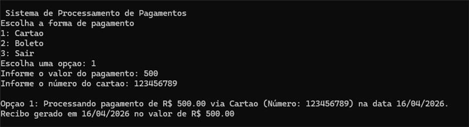

# Sistema de Processamento de Pagamentos 

Este projeto é uma aplicação console desenvolvida em **C#** que simula um sistema de processamento de pagamentos. O objetivo é aplicar conceitos fundamentais de **Programação Orientada a Objetos (POO)** e boas práticas de desenvolvimento.

## Objetivo do Projeto

Desenvolver uma ferramenta que permita escolher entre diferentes formas de pagamento (Cartão ou Boleto), coletar os dados necessários, processar a operação de forma simulada e exibir um resumo detalhado ao usuário.

---

## Tecnologias Utilizadas

* **Linguagem:** C#
* **Plataforma:** .NET Console Application
* **Conceitos Aplicados:** Classes Estáticas, Encapsulamento, Tipagem Rigorosa (`decimal`), Laços de Repetição e Organização de Arquivos.

---

## Arquitetura e Organização

Para garantir a limpeza e escalabilidade do código, o projeto foi organizado da seguinte forma:

* **`Menu.cs` (Classe Estática):** Responsável por toda a interface de interação com o usuário e fluxo de navegação.
* **Pasta `Models`:** Contém as classes de domínio do sistema:
    * `Pagamento`: Classe base (ou classe específica) contendo propriedades como Valor e Data.
    * `Cartao`: Especialização para pagamentos via cartão.
    * `Boleto`: Especialização para pagamentos via boleto.
* **Tipagem de Dados:** * Uso de `decimal` para valores monetários (garantindo precisão financeira).
    * Uso de `DateTime` para registro automático da data da transação.

---

## Como Funciona

1.  Ao iniciar, o sistema chama o método `Menu.ExibirMenu()`.
2.  O usuário escolhe entre as opções:
    * **1 - Cartão:** Solicita o valor e o número do cartão.
    * **2 - Boleto:** Solicita o valor e o código de barras.
    * **3 - Sair:** Encerra a aplicação.
3.  O sistema valida a entrada de dados e processa o pagamento, exibindo uma mensagem de confirmação com os detalhes informados.

---

## Evidências de Testes (Screenshots)

### 1. Menu Principal
> [!IMPORTANT]
> Adicione aqui o print da tela inicial do seu sistema.

### 2. Processamento de Cartão
> [!IMPORTANT]
> Adicione aqui o print do teste de pagamento com cartão.

### 3. Processamento de Boleto
> [!IMPORTANT]
> Adicione aqui o print do teste de pagamento com boleto.
.jpg)

---

## Integrantes do Grupo

* Mateus dos Santos da Silva 558436
* Nickolas Moreno Cardoso 557132
* André Giovane de Maria 556384

---

## Critérios de Avaliação Atendidos

* **Funcionamento:** Fluxo completo de navegação e repetição do menu.
* **Tipos de Variáveis:** Uso correto de `decimal` e identificadores adequados.
* **Boas Práticas:** Nomenclatura em PascalCase (padrão C#) e organização em pastas.
* **POO:** Implementação baseada em modelos de objetos e separação de responsabilidades.
